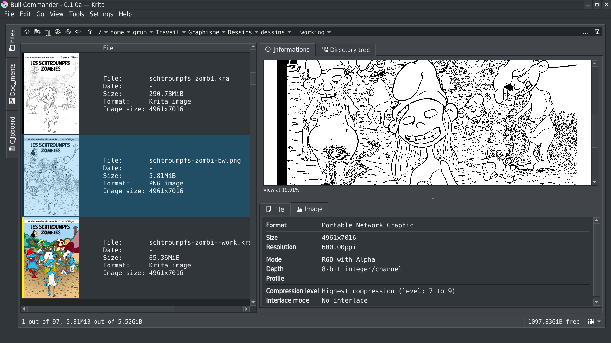

# Buli Commander

An [orthodox file manager](https://en.wikipedia.org/wiki/File_manager#Orthodox_file_managers) plugin for [Krita](https://krita.org).

## What is Buli Commander?
*Buli Commander* is a Python plugin made for [Krita](https://krita.org) (free professional and open-source painting program).

Initially, my idea was to implement my own open dialog box to replace the default one from [Krita](https://krita.org),
because the default one didn't satisfy me.

But as I'm used to work with orthodox file managers like [Midnight Commander](https://midnight-commander.org/) and
[Krusader](https://krusader.org/), I finally decided to implement my own "open dialog box" as a complete file manager.

## Disclaimer
> **Please note that current version is a beta version**

While *Buli Commander* version is not published under version *v1.0.0*, please take in consideration the following points:
- There's bugs, some of them are known, some are not (yet?) known
- Implementation can be rewritten, so a bug can disappear naturally on next version... or not :-)
- All functionalities are not yet implemented or not yet fully implemented
- Current user interface and current functionalities are not definitive and can be changed on next version

## Some screenshots
_Main user interface: dual file panel mode_

_Main user interface: single file panel mode_

_Main user interface: single clipboard panel mode with different image sources_

_Settings interface: navigation_

_Settings interface: images default action_

_Copy file: window dialog if target file already exists_

_Advanced search engine: a complex, multi-source, multi-criteria and multi-output search definition_

_Export file list: export file list as a PDF document_

_Mass Rename: use of advanced rename formulas with highlighted syntax, popup completer and help, and rename result preview_

## Functionalities

Here a list of main functionalities:
- Dual panel interface, with different possible layouts
  - List and grid view mode
  - Directories tree view
  - Image information and preview

- Intuitive navigation bar
  - Home, Previous & Up directories
  - Manual input (ie: just type path by yourself) or Breadcrumbs mode
  - Bookmarks
  - Views
  - History
  - Last opened/saved documents access

- Quick filtering
  - Wildcards/Regular expression on file name
  - Show/hide backup files
  - Show/hide hidden files
  - Show/hide not managed *(images)* files

- Image information
  - File properties
  - Detailed image properties (format, dimension, mode/depth, color profile, ...)
  - Detailed Krita image properties (About, Author, embedded palettes, references images, used fonts, external files, ...)

- File manipulation
  - Copy/Move, with advanced "already exists" dialog window
  - Delete
  - Rename
    - Unitary rename
    - Mass rename with advanced possibilities

- Search file engine
  - A basic search file interface, for basic and most common searches
  - An advanced search file interface (node based), for most complex searches
  - Allows to search from defined path
    - Including or not sub-directories
    - Including or not hidden and backup files
  - Allows to filter on file properties
    - Name
    - Size
    - Date
    - ...
  - Allows to filter on image properties
    - Format
    - Dimension
    - Ratio
    - ...
  - Allows to easily export results

- Export files as list
  - Exported perimeter definition
  - Exported information selection (which file/image properties to export)
  - Different export format
    - Text
    - Markdown
    - CSV
    - PDF
    - Krita document
    - PNG/JPEG sequences
  - All format export provides miscellaneous options to define final format/rendering

- Files conversion to Krita, Png, Jpeg format

- Miscellaneous opening modes
  - Open as new document
  - Open as Krita document
  - Open as reference image
  - Open as layer
  - Open as file layer
  - Improved GIF/WEBP import file
  - Improved SVG import file (+SVGZ import)

- Clipboard manager
  - Automatic/manual clipboard management
  - Miscellaneous sources
    - Image
    - URL (direct asynchronous download)
    - File
    - Krita's layers
  - Persistent clipboard
    - Everything in clipboard can be kept indefinitely

- Settings
  - Miscellaneous configuration settings to tune your Buli Commander a little bit :-)

## Download, Install & Execute

### Download
+ **[ZIP ARCHIVE - v0.8.0b](https://github.com/Grum999/BuliCommander/releases/download/0.8.0b/bulicommander.zip)**
+ **[SOURCE](https://github.com/Grum999/BuliCommander)**

### Installation

Plugin installation in [Krita](https://krita.org) is not intuitive and needs some manipulation:

1. Open [Krita](https://krita.org) and go to **Tools** -> **Scripts** -> **Import Python Plugins...** and select the **bulicommander.zip** archive and let the software handle it.
2. Restart [Krita](https://krita.org)
3. To enable *Buli Commander* go to **Settings** -> **Configure Krita...** -> **Python Plugin Manager** and click the checkbox to the left of the field that says **Buli Commander**.
4. Restart [Krita](https://krita.org)

### Execute
When you want to execute *Buli Commander*, simply go to **Tools** -> **Scripts** and select **Buli Commander**.

Settings allows:
- To define a shortcut for Buli Commander
- To move menu entry in Krita's *File* menu

### Tested platforms
Plugin has been tested with:
- Krita 5.0.6 (appimage) on Linux Debian 10
- Krita 5.0.6 on Windows 10

Currently don't kwow if plugin works MacOs.
I think it should be Ok, but...

## Plugin's life

### What's new?

> **Note**
> As I'm a little bit lazy and don't have so much time, there's currently no documentation...
> But detailled releases content provides some kind of documentation for some functionalities, don't hesitate to read them :-)

_[2022-06-13] Version 0.8.0b_ *[>> Show detailed release content <<](./releases-notes/RELEASE-0.8.0b.md)*
- Improve file panel - *Grid View mode - File/Image information*
- Improve file panel - *Toolbars*
- Improve file panel - *Markers*
- Improve file panel - *Multiple files selection*
- Improve file panel - *Quick filter - Icons*
- Improve file panel - *Breadcrumbs - Windows drives*
- Improve file panel - *Context menu - Status tip*
- User interface - *Windows users menu icons*
- File formats - *New supported files format*
- File formats - *Open files*

_[2022-04-13] Version 0.7.1b_ *[>> Show detailed release content <<](./releases-notes/RELEASE-0.7.1b.md)*
- Fix bug about thumbnail loading

_[2022-04-06] Version 0.7.0b_ *[>> Show detailed release content <<](./releases-notes/RELEASE-0.7.0b.md)*
- First *Beta* release!
- A big work to get plugin fully compatible with Windows OS
- Implement *Search engine*
- Improve file panel - *New available columns fields* with possibility to *Select/Unselect visible columns*
- Improve file panel - *Grid view mode*
- Improve file panel - *Selections management*
- Improve export files list - *New available fields* with possibility to *Re-order fields*
- Improve export files list - *Save & Load export definitions*
- Improve image information - *Krita document version*
- Improve image information - *Krita animated document details*
- Improve image information - *Image ratio, pixels, dimension*
- Improve "Open as" functionalities
- Improve performances
- Improve user interface
- New recognized files format
- Many (many-many) bugs fix

_[2020-12-29] Version 0.6.0a_ *[>> Show detailed release content <<](./releases-notes/RELEASE-0.6.0a.md)*

- Implement *Clipboard manager*
- Implement tool *Copy to clipboard*
- Implement function *Open file as reference image*
- Implement context menu for files
- Improve Krita image information - *Reference Images*
- Fix bug - *Active panel not highlighted*

_[2020-12-06] Version 0.5.0a_ *[>> Show detailed release content <<](./releases-notes/RELEASE-0.5.0a.md)*

- Implement *Rename*
- Implement tool *Convert files*
- Implement context menu for directories tree
- Implement shortcut for quick filter
- Improve Krita image information - *Used fonts list*
- Improve Krita image information - *Embedded palettes*
- Improve Krita Export file list - *Square paper sizes*
- Improve Krita Export file list - *Thumbnail mode*
- Fix bug - *cropped path bar*
- Fix bug - *Invalid font*
- Fix bug - *Invalid key configuration*

_[2020-11-01] Version 0.4.0a_ *[>> Show detailed release content <<](./releases-notes/RELEASE-0.4.0a.md)*

- Implement *Auto close*
- Implement *Auto open*
- Implement *Override Krita open file dialog*
- Implement tool *Export files list*
- Improve notification system

_[2020-09-27] Version 0.3.0a_ *[>>Show detailed release content<<](./releases-notes/RELEASE-0.3.0a.md)*

- Implement progress bar on background thumbnail load
- Implement progress bar on directory file content analysis
- Fix bug on Setting "cache" tab
- Add "copy" context menu on information panel
- Improve "Open as new" function
- Update theme loading (when user change Krita's interface theme, reload properly BC theme)
- Implement and improve copy/move/delete function

_[2020-09-11] Version 0.2.0a_ *[>> Show detailed release content <<](./releases-notes/RELEASE-0.2.0a.md)*

- ORA file preview use (if exists) merged image preview instead of thumbnail
- Add BACKUP files list linked to a file
- Add FILE LAYERS files list linked to a KRA image
- Improve backup extension file management (take in account suffix from Krita setting + numbered backup files)

_[2020-09-05] Version 0.1.1a_
- Fix a dependency to unexisting library

_[2020-09-05] Version 0.1.0a_
- First public version

### Bugs
Probably still a lot... :-)

> ---
> ## **WARNING**
>
> There's a very bad "random" bug that can occurs when opening Search window
> Currently not able to reproduce it systematically, it sometime randomly occurs
> When it occurs, there's a really bad Krita crash :-(
>
> If you want to use the search function, it's higly recommended to save all your unsaved Krita documents!
>
> ---

### What’s next?
Not able to define precisely in which order functionalities will be implemented, neither when, but here a list of what is currently expected for final *v1.0.0* version:
- Improve styles (especially clear style as currently plugin is optimized for dark theme)
- Improve search engine UI (allows to resize nodes manually, context menu, copy/paste/duplicate, ...)
- Implement thumbnails generation with ICC profile taken in account
- Implement *Documents* tab
- Implement Exif/IPTC/XMP metadata read
- Implement search by color
- Implement search on Exif/IPTC/XMP metadata
- Implement search on invalid krita files (missing font, missing file layers, ...)
- Implement "Predefined condition" for search
- Implement Krita file analysis tool
- Implement a better layout editor for *Export file list* (add popup completer for available marker)

## License

### *Buli Commander* is released under the GNU General Public License (version 3 or any later version).

*Buli Commander* is free software: you can redistribute it and/or modify it under the terms of the GNU General Public License as published by the Free Software Foundation, either version 3 of the License, or any later version.

*Buli Commander* is distributed in the hope that it will be useful, but WITHOUT ANY WARRANTY; without even the implied warranty of MERCHANTABILITY or FITNESS FOR A PARTICULAR PURPOSE. See the GNU General Public License for more details.

You should receive a copy of the GNU General Public License along with *Buli Commander*. If not, see <https://www.gnu.org/licenses/>.

Long story short: you're free to download, modify as well as redistribute *Buli Commander* as long as this ability is preserved and you give contributors proper credit. This is the same license under which Krita is released, ensuring compatibility between the two.
