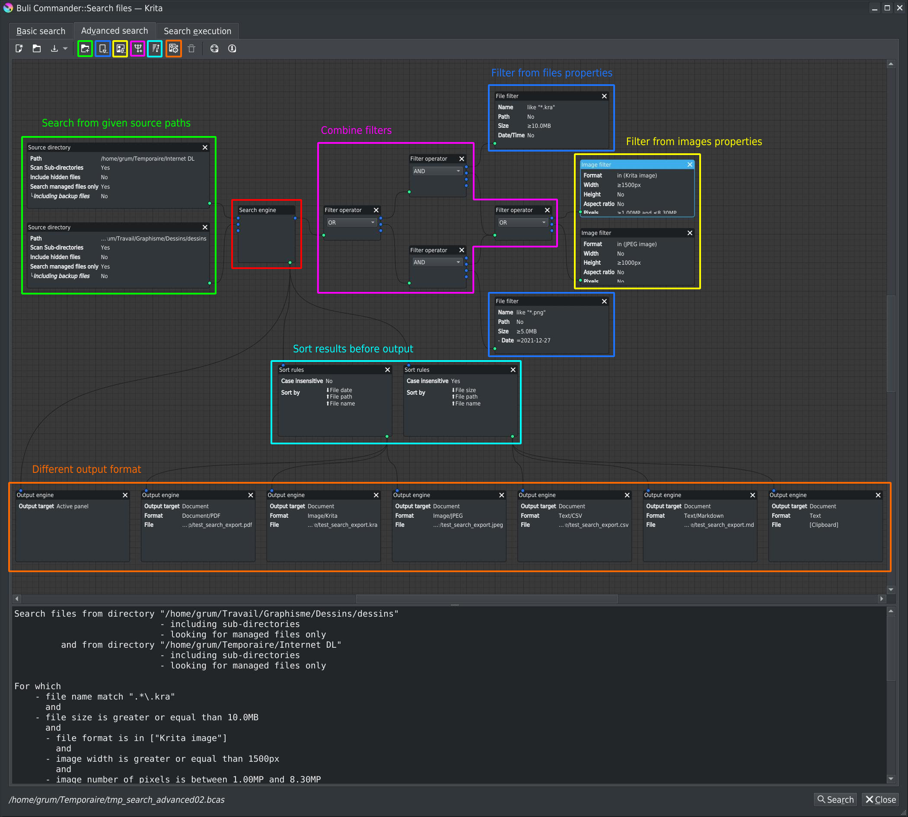
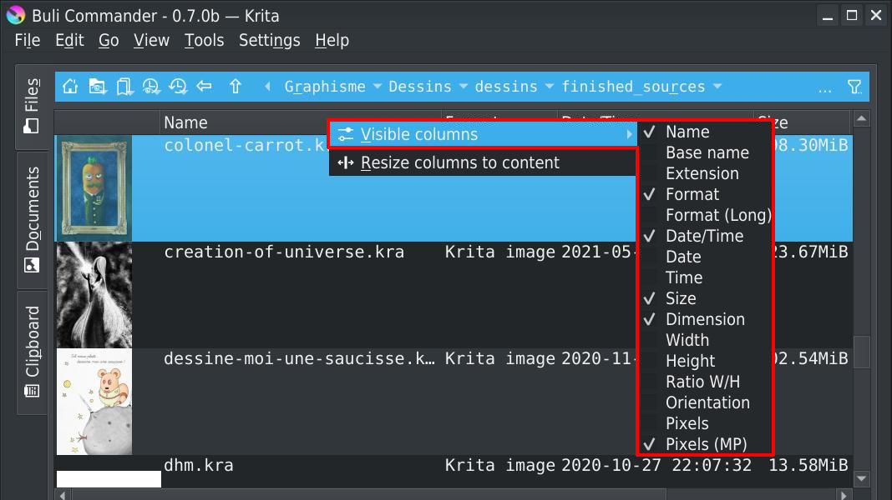

# Buli Commander :: Release 0.7.0b [2021-xx-xx]

## Beta release!
Plugin is now stable enough to be considered in *beta* version instead of previous *alpha* state.
There's still work before *v1.0.0*, but main functionalities are now available and can be used properly.

## Implement *Search*
The biggest implemented functionality for this version!
A search engine has been implemented and let user to search for files/images with specific characteristics.

### Basic search
The basic search interface can be used for most common searches:
- Search from a source path
- Search for file properties
- Search for image properties

*Search results from **Basic search** are displayed in current file panel, allowing to do all possible action on files like in any directory or view*

### Advanced search
The advanced search interface use a node system and allows to build from simple to complex searches:
- Search from multiple source paths
- Search from combination of files & images properties
- Multiple output format with sort options

*Search results from **Advanced search** interface can be returned in file panel, but also can be plugged with **Export files list** tools to generate different report type:*
- Text documents (text, markdown, csv)
- PDF documents
- Krita documents
- PNG/JPEG sequences documents

### Console
When search is executed, it could take more or less time, according to number of files to analyse, search complexity, output results.

Search progress is visible in a console, and can be cancelled:

### Save & Load search definition
For user doing frequent identical searches, search definition can be saved and loaded (from **Basic search** and **Advanced search**)

- **Basic search** definitions files are saved with `.bcbs` extension
- **Advanced search** definitions files are saved with `.bcas` extension

## File panels

### New columns fields
New columns fields have been added to file panel

- Right click on column name to get context menu and select which columns are visible or not
- Drag'n'drop column name to reorder them

Columns settings is distinct for *left* and *right* file panels

### Grid view
A grid view mode has been added:

List/Grid mode is selected from menu *View > layout* or from bottom/right button menu

Like for list mode, icon size of grid mode can be change with <kbd>CTRL</kbd>+<kbd>Mouse wheel</kbd> or from slider available in menu.

### Selections
Selection management has been improved.

Selected items are kept in panel when content is updated (files added, deleted, updated; even if not managed through Buli Commander)
- Do not reload content, just update changed files
- Improve sort refresh to avoid to lost current selection

## Improve *Export files list*

### Save & Load export definition
It's now possible to save and load export definition; no need to reconfigure them each time :-)

- **Export files list** definitions files are saved with `.bcefl` extension

### Available fields & order
New fields are available for export:
- Image ratio (decimal value)
- Image ratio ("portrait", "landscape", "square")
- Image pixels
- Image pixels (in Megapixels)

Fields can now be re-ordered by drag-n-drop

## Improve image information

### Krita files - *All*
Add Krita version from which document has been created/edited

### Krita files - *Animated images*
Review method to determinate if Krita file is animated (bug fix)

Provided informations about Krita animation files are completed with:
- Frame rate
- Rendered frames (start, end, number of frames, duration)
- Last frame (number, duration)
- Total number of keyframes (find through <u>all animated layers</u>)

### All files
Add new properties:
- Image resolution
- Image dimension in unit (mm, cm, in) if resolution is available
- Image ratio (decimal value + text value)
- Image number of pixels (in pixels + Megapixels)

Preview for images with transparency has been improved: checkerboard is now not impacted anymore by pan & zoom actions

## Improve performances
- Review how metadata & thumbnail cache are built and stored
  - Thumbnail for images with alpha channel are generated as PNG
  - Thumbnail for images without alpha channel are generated as JPEG (faster & smaller)
  - Images metadata are stored in a SQLite database file
- Asynchronous thumbnail loading has been improved
- Image list/grid now use a Model/View to improve performances

## New recognized files format
The following files format are now taken in account by Buli Commander:
- KRZ
- BMP

## *Open as* functions

### Improve *Open as reference image*
Not sure why, but currently it's seems not possible anymore in Krita 5 to paste a JPEG image as a reference image.

The *Open as reference image* function fix this problem and also allows to use any image format recognized by Buli Commander (BMP, GIF, KRA, PSD, ...) to be opened as *(an embedded)* reference image.

### Implement *Open as Layer*
Add a menu entry *Open as Layer*

All selected files can be opened as new layers in active document:
- SVG files are opened in *Vector Layer*
- Raster files are opened in *Paint Layer*

### Implement *Open as File Layer*
Add a menu entry *Open as File Layer*

All selected files are opened as new file layers

## Improve UI
Miscellaneous improvements in user interface has been made

### Start Buli Commander with shortcut
From Krita settings (*Settings > Configure Krita... > Keyboard Shortcut >> Scripts*) it's now possible to define a shortcut to start Buli Commander

### Reorganize *Open...* menu entries
All *Open as* menu entries have been moved in a dedicated sub-menu *Open as* and all *...and close Buli Commander* variations have been removed.

Context menu has been updated too.

The *File* menu is more clear and easier to read.

### Buli Commander in *File* menu

An option allows to move **Buli Commander** menu entry from usual *Tools > Scripts* menu to *File* menu

In Buli Commander *Settings > Preferences... >> General*

When active, Buli Commander menu entry is available in *File* menu between *Open recent* and *Save*

### Dialog windows
Most of dialog windows have been redesigned

Create directory dialog window

Delete file/directory dialog window

*A warning is displayed if at least one directory is not empty*

Copy/Move and also all basic messages & confirmation dialog windows are redesigned

### Improve error message for clipboard
Improve clipboard panel error message when download failed for an url

*Display and error status + error message*

### Thumbnails size
Sliders for thumbnails size now display current selected size in pixels

### Import animated files
Import of animated files can take time.

When an animated file (GIF, WebP) is opened, now a progress window allows to check import progress and eventually cancel it

## Fix bugs
Some bugs have been fixed

### Read Krita files
- Some animated Krita files weren't recognized as animated files
- Some files with reference images (*linked* instead of *embedded*) weren't properly read

These problems are now fixed

### Specific to *Windows* users
- Monospace font was not properly applied in interface
- Copy/Move files was not working properly due to unescaped separator `\` in paths
- Export files tool was not working on *Windows*
- A "Copy file" action from windows explorer now properly load files into clipboard (if files are image files)

These problems are now fixed

### Miscellaneous
- Plugin was not compatible with Krita 5
- After cache was cleared, it was not possible anymore to regenerate it
- Files for which extension was not lowercase were not recognized as valid files and not visible in panel list
- If zoom level was changed during thumbnail loading, progress bar was not hidden when load process was finished
- Copy/Move was not working properly if target path was renamed
- When a document without image preview (or image preview not able to load) was selected, a python script message error was displayed
- When a document without image preview (directory, non image file or not thumbnail preview activated) was selected, size of Icon was growing each time selected document was changed
- When theme was changed in Krita, a python script message error about 'autoreload' was displayed
- When from one panel (located in directory A) a directory B was deleted, if opposite panel was located to deleted directory (or subdirectory of deleted directory), panel refresh was not properly made and mouse cursor was stuck on "wait"
- When Buli Commander is defined to be automatically opened at startup, if user had time to open a document before start/end of plugin initialization, a script error was raised
- Fix miscellaneous minor bugs

## Technical improvements - *Use & enhance common plugin library PkTk*
Use of PkTk library, that provides common modules, classes & widgets used by Buli Commander and that can also be re-used for other plugins have been moved to PkTk library.
*Note: PkTk library is not yet available in its own repository, need to wait for that because still WIP and no documentation yet...*
