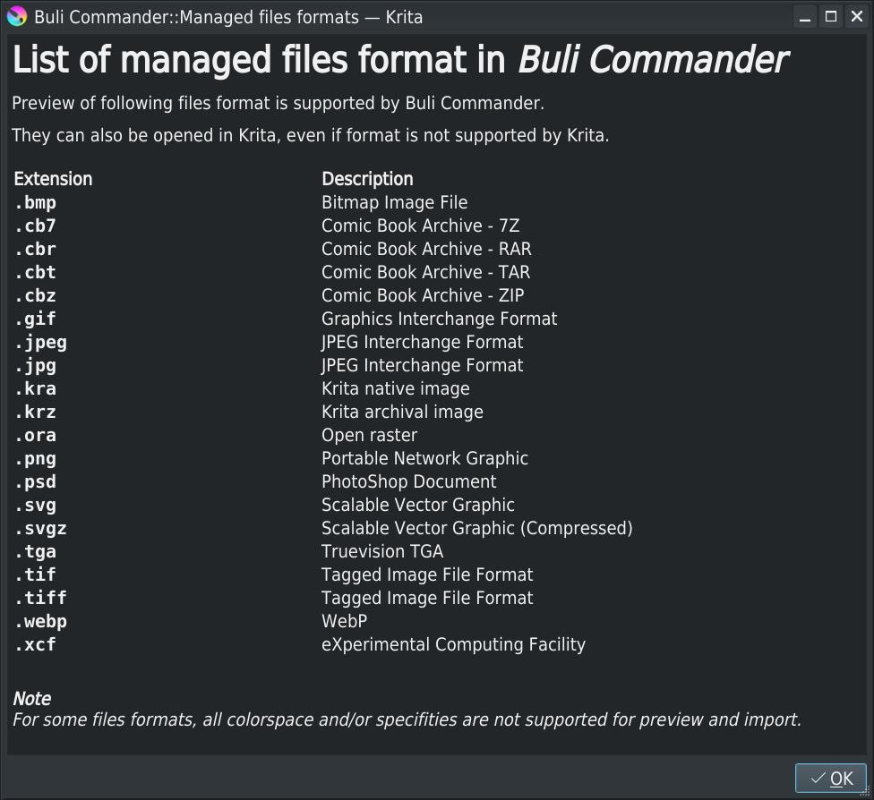

# Buli Commander :: Release 0.8.0b [2022-06-13]

## File panels

### Grid view mode - File/Image information
A grid view mode has been improved: it's now possible to define, through settings, informations to display with thumbnail.

*Settings for grid view mode*

*--> Drag'n'drop properties to reorder*

*Grid view mode: properties "Over" thumbnails*

*Grid view mode: properties on "Bottom side" of thumbnails*

### Toolbars
All functions from menu are now available through toolbars.

User can create as many toolbar as needed, and configure each toolbar.

*Toolbars example*

*Toolbars settings*

### Markers
Markers are set to files and allows to manually prepare selections.

#### Why markers?
It's already possible to select files, so why markers? What's the difference?

Selection in BuliCommander works as usually in list: it's possible to make multi-selection with <kbd>Shift</kbd> and <kbd>Ctrl</kbd> modifiers.

When a file is selected without pressing a modifier key, current selection is replaced by a new one: the selected file.
It's the standard about how selections works within a list.

Markers allow to prepare selection.

#### How to use markers?
The menu *Edit* provides some new functionalities to work with markers:

| Menu item | Shortcut | Function |
| --- | --- | --- |
| `Select marked` | <kbd>Ctrl</kbd>+<kbd>M</kbd> | Select all marked files |
| `Mark/Unmark` | <kbd>Space</kbd> | Invert marked state of current item and select next item |
| `Mark all` | <kbd>Ctrl</kbd>+<kbd>Space</kbd> | Mark all files |
| `Mark none` | <kbd>Ctrl</kbd>+<kbd>Shift</kbd>+<kbd>Space</kbd> | Unmark all files |
| `Invert marks` | <kbd>Shift</kbd>+<kbd>Space</kbd> | Invert marked state for all files |

> Notes:
> - Changing selection have no impact on marked files
> - Changing directory have no impact on marked files
>   - Changing directory and going back to a directory where some files have been marked, they're still here
>   - Marked files are kept for current session only: when BuliCommander is closed, marks are lost
> - Marked files are for current panel only
>   - If both panels are on the same directory, you can have different marked files
> - When files are marked, current selected items are unchanged except for `Mark/Unmark` action

Main usage is to walk through files in directory with <kbd>Up</kbd>/<kbd>Down</kbd> arrow keys and mark files for which characteristics are interesting.
Once all interesting files are marked, made a selection and then work on selected files.

Marked files are highlighted by a small triangle in bottom/right side

*A marked file in list view*

*A marked file in grid  view*

### Multiple files selection
With version 0.8.0b, when multiple files are selected, properties for the last selected/unselected file are provided in informations panel (with previous version, a message _"No preview for multiple selection"_ was displayed)

### Quick filter - Icons
Quick filter now provides icons to affine filter

| Icons | Description |
| --- | --- |
| `Regular expression` | When checked, given filter string is a regular expression |
| `Case sensitive` | When checked, filter string is case sensitive |
| `Marked files` | When checked, filter is reduced to marked files |

### Breadcrumbs - Windows drives
For Windows users, an additional entry has been added in breadcrumbs to be able to easily select drive.

> Note:
> - Only mounted drives are available in list, special folders (Libraries, Quick access, Desktop, Images, ...) are not available here

### Context menu - Status tip
A very small improvement: add status tip for context menu

## User interface

### Windows users menu icons
For Windows users, icons in Krita menu are explicitely deactivated (see commit [493ca38](https://invent.kde.org/graphics/krita/-/commit/493ca38910f2a1a4233b64815ce60a6fa3205bc2))

Not sure why it has been removed only for Windows users, but bored to not have icons in Buli Commander menus when testing plugin on Windows, an option has been added in settings to let the possibility to display icons.

> Note:
> - For other OS, option is deactivated

## File formats

### New supported files format
The following files format have been added in list of managed file format; thumbnails and image properties for these files are now available.

| Extension | Format | Description |
| --- | --- | --- |
| `.tga` | Truevision Targa | Thumbnail available only if _Qt Image reader_ support TGA |
| `.tif` `.tiff` | Tagged Image File Format | Thumbnail available only if _Qt Image reader_ support TIFF  Due to all possible TIFF image format (compression, colorspace, ...) all images can't be read properly in BuliCommander (and probably also in Krita ^_^') |
| `.svgz` | Scalar Vector Graphics (GZipped) | Thumbnail always available |
| `.cbz` `.cbt` `.cbr`(1)(3) `.cb7`(2)(3) | Comic Book Archive | Thumbnail always available for `.cbz` `.cbt` (ZIP and TAR archives)  (1)For `.cbr` files (RAR archives) `Unrar` or `7-Zip` must be installed on system (2)For `.cb7` files (7z archives) `7-Zip` must be installed on system (3)Implementation only available for Windows and Linux |

### Open files
The following files format *Open* have been implemented/improved

| Extension | Format | Desciption |
| --- | --- | --- |
| `.svg` `.svgz` | Scalable Vector Graphics | Properly take in account document size, according to unit and resolution   Also, Buli Commander allows to open SVGZ files in Krita like for SVG files (currently Krita v5.0.6 can't open SVGZ files)  Improve _Open_ function  |
| `.cbz` `.cbt` `.cbr`(1)(3) `.cb7`(2)(3) | Scalable Vector Graphics | Buli Commander allows to open Comic Book Archive files in Krita with dedicatd user interface dialog *Comic Book [Pepper & Carrot](https://www.peppercarrot.com/) - David revoy*   (1)For `.cbr` files (RAR archives) `Unrar` or `7-Zip` must be installed on system (2)For `.cb7` files (7z archives) `7-Zip` must be installed on system (3)Implementation only available for Windows and Linux |

Menu *Help > Managed files formats...* provides a list of files formats managed with Buli Commander, according to your installation

