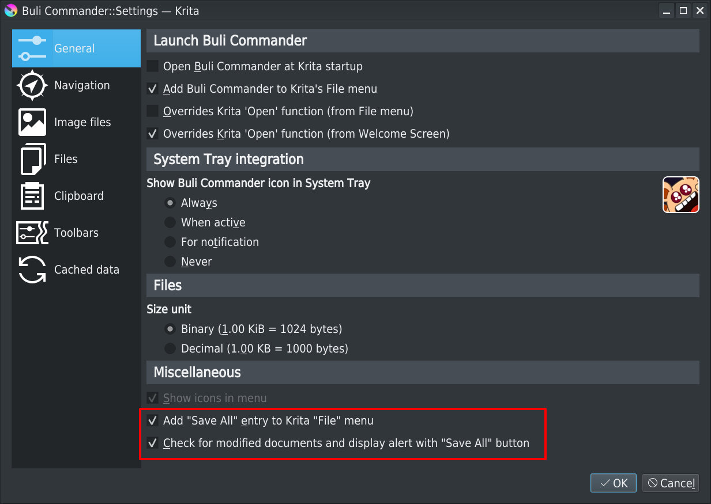

# Buli Commander :: Release 0.9.0b [2022-XX-XX]

## Search engine

### Reduce search execution time duration
[Feature request #20](https://github.com/Grum999/BuliCommander/issues/20)

Search engine core has been improved to reduce search execution time duration, especially if search is only based on *file properties* (file name, path, date, size)

### Limit results
[Feature request #14](https://github.com/Grum999/BuliCommander/issues/14)

A new rule has been added to limit number of results provided to output.

When number of found files is greater than provided limit, 2 possible actions are available:
- Do nothing
- Limit exported result to the first *Nth* items

In all case, an alert is displayed in console about result.

## File panels

### Grid view mode - Smooth thumbnail scroll

[Feature request #5](https://github.com/Grum999/BuliCommander/issues/5)

Improve thumbnail scroll, taking in account:
- Current thumbnail size
- Current available view height

This ensure for big thumbnail on small view to get a smaller scroll, and for small thumbnail on a large view, to have bigger scroll.

## Clipboard panels

### Save as...

[Feature request #18](https://github.com/Grum999/BuliCommander/issues/18)

Allows to save clipboard content to a given directory.

> **Note**
> This function is more a facility to get access to clipboard image on file system without having to open it in Krita
> File name is built automatically, use rename/mass rename if needed

## User Interface

### Implement *Override Krita Welcome Screen "Open file" dialog*

[Feature request #6](https://github.com/Grum999/BuliCommander/issues/6)

This option allows to replace Krita's "Open file" dialog with Buli Commander.

Buli Commander settings make distinction between:
- "Open file" action from menu _File_
- "Open file" action from _Welcome screen_

### Implement *Save All*

[Feature request #7](https://github.com/Grum999/BuliCommander/issues/7)

#### Settings

New options have been added to Buli Commander Settings to let user being able to save all modified documents in one click.

| Option | Description |
| --- | --- |
| Add "Save All" entry to Krita "File" menu | When checked, a new menu entry _Save All_ is added in Krita's _File_ menu |
| Check for modified documents and display alert with "Save All" button | When checked, a message bar with a `Save files` button inform user that there's some unsaved documents |

#### Krita "Save All" menu entry
When active, the new _Save All_ menu entry is located in _File_ menu after _Save As..._ entry

It's possible to define a shortcut (none defined by default) to _Save All_ action in Krita's shortcut settings window

#### Buli Commander _Save files_ message bar
When active, a message bar is displayed in Buli Commander to inform that some files are modified.
Button `Save files` allows to save all files in one click.

> **Note**
> For technical reasons (currently not possible to detect modification made on a document without polling), message bar is updated **only when Buli Commander window get focus**

## File management

### Improve mass renaming

#### Basic editor

[Feature request #8](https://github.com/Grum999/BuliCommander/issues/8)

Mass renaming have been improved:

- Allows to save/load formula
- Context menu for quick and easy access to all Function & Keywords (with complete tooltip)
- Better error messages for invalid syntax

#### Visual editor

[Feature request #8](https://github.com/Grum999/BuliCommander/issues/8)

A visual editor, using nodes, has been implemented to build formula:
- Allows to build from scratch, save/load formula
- Build nodes automatically from formula defined in basic editor
- Provide access to Functions, Keywords, Free text, free text concatenation

#### Language improvement

[Feature request #19](https://github.com/Grum999/BuliCommander/issues/19)

The function `padding` has been added to language, allowfing to define padded fixed length text.

Text can be:
 - *left* padded (default)
 - *right* padded
 - *center* padded

Padding character is a space by default, but any character can be used

## Fix bugs
Some bugs have been fixed

### Search for condition generate python exception

[Feature request #13](https://github.com/Grum999/BuliCommander/issues/13)

A right click in time field in search *file filter* condition was generating a python script exception

This problem is now fixed

